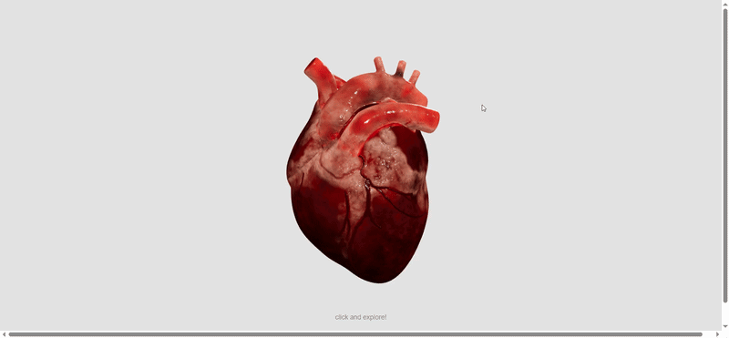

    
    <h3 align="center">HeartLab 3D | Cardiac Explorer</h3>
    
An awesome 3D cardiac visualization tool with intuitive interaction!

    <!-- <a href="https://github.com/fateme96E/HeartLab-3D">View Demo</a> -->

 
 

    
Table of Contents

    <ol>
        <li>
            <a href="#about-the-project">About The Project</a>
        </li>
        <li>
            <a href="#built-with">Built With</a>
        </li>
        <li>
            <a href="#preview">Preview</a>
        </li>
        <li>
            <a href="#view-demo">View Demo</a>
        </li>
    </ol>

## About The Project
HeartLab 3D is an interactive tool to explore the human heart in real-time, designed for intuitive learning.

**Features:**
* Zoom and explore inside the heart
* Rotate freely to view all angles
* Simple explanations for each part
* Blood pathway shown for each section
* Cardiac parts color-coded by function

### Built With
* [![Three.js][Threejs]][Threejs-url]
* [![Vite][Vite]][Vite-url]
* [![JavaScript][JavaScript]][JavaScript-url]
* [![CSS3][CSS3]][CSS3-url]
* [![HTML5][HTML5]][HTML5-url]

### Preview

    

### View Demo
<a href="https://heart-lab-3d.netlify.app/">
    
Click below to explore the 3D heart!

</a> 

(<a href="#readme-top">back to top</a>)

[Threejs]: https://img.shields.io/badge/Three.js-000000?style=for-the-badge&logo=three.js&logoColor=white
[Threejs-url]: https://threejs.org/
[Vite]: https://img.shields.io/badge/Vite-646CFF?style=for-the-badge&logo=Vite&logoColor=white
[Vite-url]: https://vitejs.dev/
[JavaScript]: https://img.shields.io/badge/JavaScript-F7DF1E?style=for-the-badge&logo=javascript&logoColor=black
[JavaScript-url]: https://developer.mozilla.org/en-US/docs/Web/JavaScript
[HTML5]: https://img.shields.io/badge/HTML5-E34F26?style=for-the-badge&logo=html5&logoColor=white
[HTML5-url]: https://developer.mozilla.org/en-US/docs/Web/HTML
[CSS3]: https://img.shields.io/badge/CSS3-1572B6?style=for-the-badge&logo=css3&logoColor=white
[CSS3-url]: https://developer.mozilla.org/en-US/docs/Web/CSS

